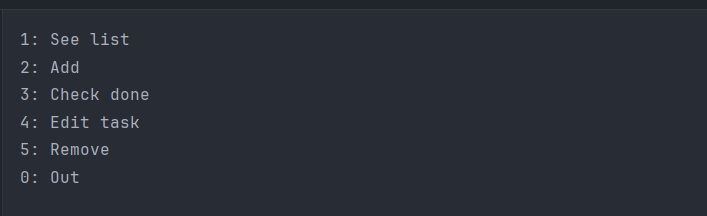

This if my first project I made by using
It has a text based user interface via the command-line. U can see it in the image below.

Im using txt file to store data

When i make this project, i can learn some basic java syntax and know how to handle a file in java

If my code not clean or have any bugs, please .... i don't know how u can report it to me but please give me a star.
It will be something that will motivate me to improve more and more.

Thank you for reading this!!!
